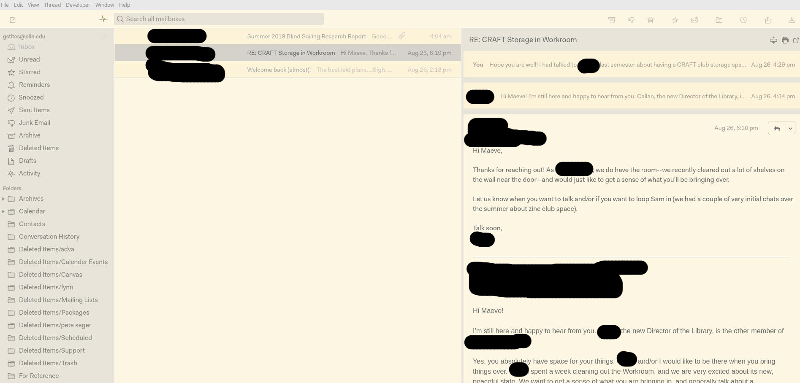

# Mailspring Mae Theme

Theme for the [Mailspring](http://www.getmailspring.com/) email client.

## Install theme

1. Clone or download this repository

2. Move the folder to a location of your choice

3. Open Mailspring  and install the theme by going to `Mailspring > Install New Theme...`
   and selecting the directory.
